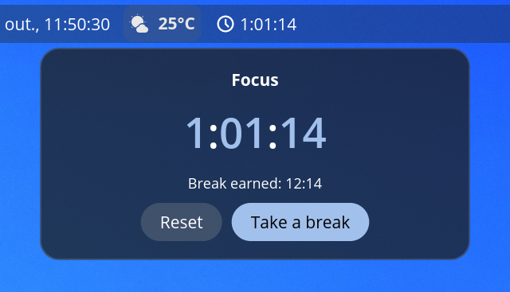

# Flowmodoro for COSMIC

A Flowmodoro timer applet for the
[COSMIC](https://system76.com/cosmic) desktop panel.

Unlike Pomodoro's fixed 25-minute blocks, Flowmodoro lets you focus for as long as you are in
flow. When you stop, you earn a break of **one fifth** of the time you focused
(50 min of focus → 10 min of break).



## How it works

| Phase     | Panel shows              | Popup buttons                    |
|-----------|--------------------------|----------------------------------|
| Idle      | clock icon               | *Start focus*                    |
| Focus     | icon + elapsed time      | *Reset*, *Take a break*          |
| Break     | icon + remaining time    | *Skip break*, *Back to focus*    |

- **Click the panel button** to open the popup with the current phase, the clock and the break
  you have accrued so far.
- **Forgot to start the timer?** Click the minutes or seconds in the popup clock, type the
  correct value and press <kbd>Enter</kbd> or ✔. <kbd>Esc</kbd> cancels. Editing while idle
  starts a focus session with that much time already counted.
- **Notifications** are sent when a break starts and when it ends.
- **Multiple monitors:** the COSMIC panel runs one applet process per monitor. They share their
  state through a small file in `$XDG_RUNTIME_DIR` (`$XDG_RUNTIME_DIR/app/<id>` under Flatpak),
  so every panel shows the same timer. The timer survives panel restarts and resets on logout.

The interface is in English and Brazilian Portuguese, picked from the system language
(`LC_ALL`, `LC_MESSAGES` or `LANG`). To add a language, add a `Tr` table in `src/main.rs` and a
branch in `pick()`, plus the `[xx]` / `xml:lang` entries in `data/`.

## Install

### From the COSMIC Store

Once published, search for **Flowmodoro** in the *Applets* section of the COSMIC Store, then add
it in **Settings → Desktop → Panel → Applets**.

### From source

Requirements: Rust ≥ 1.93 ([rustup](https://rustup.rs)), [`just`](https://github.com/casey/just)
and the libcosmic build dependencies:

```sh
# Pop!_OS / Ubuntu / Debian
sudo apt install cargo just pkg-config libxkbcommon-dev libfontconfig-dev libfreetype-dev libexpat1-dev cmake
# Fedora
sudo dnf install cargo just pkgconf libxkbcommon-devel fontconfig-devel freetype-devel expat-devel cmake
```

Then:

```sh
git clone https://github.com/JHPG/cosmic-ext-applet-flowmodoro.git
cd cosmic-ext-applet-flowmodoro
just install      # installs to ~/.local, no root needed
```

Add **Flowmodoro** in **Settings → Desktop → Panel → Applets**. If it doesn't show up, restart the
panel with `pkill -x cosmic-panel` (the session starts it again).

To remove it: `just uninstall`.

### As a local Flatpak

```sh
flatpak install --user flathub org.flatpak.Builder org.freedesktop.Sdk.Extension.rust-stable//25.08
just flatpak
```

## Development

```sh
just test         # unit tests
just build        # release build
just validate     # check the AppStream metainfo and desktop entry
```

All code lives in [`src/main.rs`](src/main.rs). The break ratio is the `BREAK_RATIO` constant.

## License

[GPL-3.0-only](LICENSE)
